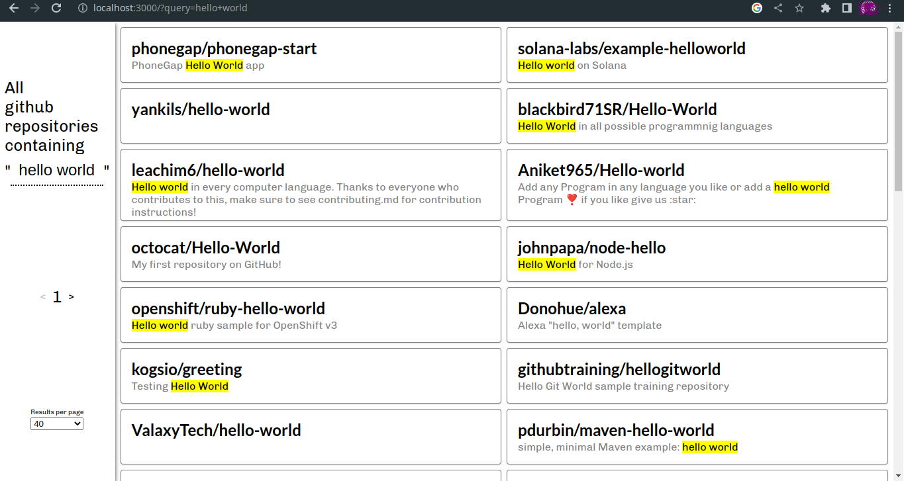

# Introduction
This is a Ruby on Rails application that utilizes the GitHub API to search for repositories based on user input. The application is paginated, and the user can type a search query in the input field in the sidebar and hit Enter/Return to retrieve matching results. This README file provides instructions on how to run the application, its basic architecture, and how to use it.

# Prerequisites
This project does not have any dependency on a database. It is assumed that Ruby is already installed on the system. This project uses version 3.1.2 of Ruby, which can be changed in the Gemfile if this particular version is not available in the system. For example, if the desired Ruby version is 3.0.0, changes in Gemfile would be:

```ruby
ruby "3.0.0"
```

# Steps to run locally
1. Clone the repo on your system using `git clone https://github.com/anew-bhav/a1b87f4c8a2fc9d49ddfc6a1922047ebc.git`
2. Navigate to the cloned directory using `cd a1b87f4c8a2fc9d49ddfc6a1922047ebc`
3. Run `bundle install`
4. Run `bundle exec rails server`
5. This will start a server listening to requests on `http://localhost:3000`
6. Visit the URL mentioned in step `5` to play around with the application. [How to Use](#how-to-use)

# Basic Architecture
1. The application is a classic server-rendered Rails application.
2. There is a `HomeController` with single action called `index`, which is dispatched when the root route is hit. ie `http://localhost:3000`.
3. The `index` action takes a search `query` as parameters and makes a call to the GitHub API. The parameter is available to controller through html form submission.
4. There is a service class called `Github` that is responsible for making the API call to GitHub and returning a list of repositories that match the particular search term.
5. The search term is highlighted in the results, similar what happens when we search a repository in github website. [exhibit](https://github.com/search?q=hello)

# How to Use
1. The application user is expected to type the search query in the input field in the sidebar and hit Enter/Return on the keyboard. 2. The page would reload, and results (if available) would be displayed as a scrollable list.
3. In case no results are found, a relevant message is displayed.
4. The application is paginated, but there is a catch: the API is rate-limited, make numerous requests in quick succession would lead to rate limiting. When this happens, relevant messages are shown in the UI.
5. The API can serve only the first 1000 results. If by any chance, the request tries to access the 1000+1th record, a relevant error message is shown on the page.
6. The returned results are passed to the view layer as data.

# Project Preview
